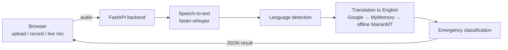

# Emergency Call Translation

An AI-based emergency communication platform for multilingual, real-time call translation. It helps emergency operators understand callers who speak **Urdu, Pashto, Punjabi or English**: the caller's speech is transcribed, translated to English and classified by emergency type (**Fire, Medical, Accident, Police**) so the operator can respond quickly.

Final Year Project by **Waqas Hussain**.

---

## Table of contents

- [Features](#features)
- [How it works](#how-it-works)
- [Tech stack](#tech-stack)
- [Project structure](#project-structure)
- [Getting started](#getting-started)
  - [Option A: Run with Docker (recommended)](#option-a-run-with-docker-recommended)
  - [Option B: Run locally without Docker](#option-b-run-locally-without-docker)
- [Using the application](#using-the-application)
- [Configuration](#configuration)
- [API reference](#api-reference)
- [Troubleshooting](#troubleshooting)
- [Limitations and future work](#limitations-and-future-work)
- [Privacy note](#privacy-note)

---

## Features

| Feature | Description |
|---|---|
| **Upload audio** | Upload a recorded call (MP3, WAV, M4A, OGG/Opus, WebM, AAC, FLAC, AMR) and get the transcript, English translation and emergency type. |
| **Record audio** | Record directly from the browser microphone and submit it for translation. |
| **Live translation** | Stream the microphone to the server over a WebSocket. The transcript and translation of the whole call update every few seconds. |
| **Language detection** | Detects Urdu, Pashto, Punjabi or English automatically, or uses the language the operator selects. |
| **Emergency classification** | Tags each call as Fire, Medical, Accident, Police or Unknown. |
| **Contact form** | Visitors can send a message, which is stored in the database. |

## How it works



1. **Speech-to-text** ([`speech_service.py`](backend/app/services/speech_service.py))
   Audio is transcribed with [faster-whisper](https://github.com/SYSTRAN/faster-whisper), an optimized OpenAI Whisper implementation that runs on CPU.
   - Whisper's language guess is limited to the supported languages. Its Hindi score is counted towards Urdu, since spoken Urdu and Hindi are nearly identical, and its Persian and Arabic scores are counted towards Pashto. The audio is then transcribed with that language locked. This stops Urdu calls from coming out in Hindi (Devanagari) script, which cannot be translated.
   - A short in-language example emergency call is given to Whisper as context, so it uses the correct script and spelling for common emergency words (گھر، آگ، حادثہ، ایمبولینس …).
   - When a transcript starts looping, Whisper retries at a slightly higher temperature, and any looping text left over is removed.

2. **Language detection** ([`language_service.py`](backend/app/services/language_service.py)): uses Whisper's language, Pashto-only letters (ټ ډ ړ ږ ښ ګ ځ څ ې), Gurmukhi script and `langdetect` as a fallback.

3. **Translation** ([`translation_service.py`](backend/app/services/translation_service.py))
   - Long text is split into sentence groups. Each group is translated by the first provider that returns a real English result: **Google Translate**, then Google with auto-detect, then **MyMemory**, then an **offline Helsinki-NLP MarianMT** model (Urdu and Punjabi).
   - Punjabi in Shahmukhi (Arabic script) is sent as `pa-Arab`. With plain `pa` the providers only transliterate it.
   - If every provider fails, the text is marked `[Translation unavailable]` and the original is shown. The system never makes up a translation.

4. **Classification** ([`classification_service.py`](backend/app/services/classification_service.py)): keyword matching on the English translation and the original text.

5. **Live mode** ([`live_speech_service.py`](backend/app/services/live_speech_service.py), [`websocket_routes.py`](backend/app/routes/websocket_routes.py))
   - The browser sends a self-contained 5-second WebM/Opus clip over the WebSocket.
   - The server keeps the whole call's transcript. After each clip it re-translates the full call, so the translation has sentence context. Earlier sentences come from a cache, so only the new part is sent to the translator.
   - The language detected in the first clip is kept for the rest of the call.
   - If the CPU falls behind real time, queued clips are merged into a single transcription pass.

## Tech stack

**Backend**
- Python 3.10, FastAPI, Uvicorn (REST + WebSocket)
- faster-whisper (CTranslate2) for speech recognition
- Hugging Face Transformers + PyTorch (MarianMT offline translation)
- langdetect
- SQLAlchemy + SQLite

**Frontend**
- React 19 (Create React App), React Router
- Bootstrap 5
- Axios, browser MediaRecorder and WebSocket APIs

**Deployment**
- Docker and Docker Compose
- Nginx (serves the React build and proxies `/api` and `/ws` to the backend)

## Project structure

```
EmergencyCallTranslation/
├── docker-compose.yml          # Runs backend + frontend together
├── backend/
│   ├── Dockerfile
│   ├── requirements.txt
│   ├── run.py                  # Local dev server (uvicorn with reload)
│   └── app/
│       ├── main.py             # FastAPI app, CORS, routers, DB setup
│       ├── config/database.py  # SQLAlchemy engine/session (DATABASE_URL)
│       ├── models/             # SQLAlchemy models (contact messages, logs)
│       ├── schemas/            # Pydantic request/response schemas
│       ├── routes/
│       │   ├── emergency_routes.py   # POST /api/emergency/process
│       │   ├── websocket_routes.py   # WS   /ws/live-transcription
│       │   └── contact_routes.py     # POST /api/contact/
│       ├── services/
│       │   ├── speech_service.py         # Whisper speech-to-text
│       │   ├── language_service.py       # Language detection
│       │   ├── translation_service.py    # Translation to English
│       │   ├── classification_service.py # Emergency type
│       │   ├── live_speech_service.py    # Live call session state
│       │   └── file_service.py           # Saves uploads (UUID names)
│       ├── utils/constants.py
│       └── uploads/            # Temporary upload storage (git-ignored)
└── frontend/
    ├── Dockerfile
    ├── nginx.conf
    ├── package.json
    ├── public/
    └── src/
        ├── App.js              # Routes
        ├── services/api.js     # Axios client (REACT_APP_API_URL)
        ├── components/         # Navbar, Footer, HeroBanner, ResultCard
        └── pages/              # Home, UploadAudio, RecordAudio,
                                # LiveTranslation, ContactUs
```

## Getting started

### Prerequisites

- **Internet connection** on first run (to download the Whisper models, about 0.5 to 1.5 GB) and for the online translation providers.
- At least **8 GB RAM** is recommended (the `medium` Whisper model uses about 2 to 3 GB).
- For Docker: [Docker Desktop](https://www.docker.com/products/docker-desktop/).
- For local setup: **Python 3.10+**, **Node.js 18+** (22 recommended) and **Git**.

Clone the repository:

```bash
git clone https://github.com/<your-username>/EmergencyCallTranslation.git
cd EmergencyCallTranslation
```

### Option A: Run with Docker (recommended)

```bash
docker compose up --build
```

- Frontend: <http://localhost:3000>
- Backend API: <http://localhost:8000> (interactive docs at <http://localhost:8000/docs>)

The first build takes a while (PyTorch is large). Whisper models download on the first request and are cached in the `model-cache` Docker volume, so later starts are fast.

To stop:

```bash
docker compose down
```

### Option B: Run locally without Docker

#### 1. Backend

```bash
cd backend
python -m venv .venv
```

Activate the virtual environment:

- Windows (PowerShell): `.venv\Scripts\Activate.ps1`
- Windows (cmd): `.venv\Scripts\activate.bat`
- macOS / Linux: `source .venv/bin/activate`

Install dependencies and start the server:

```bash
pip install -r requirements.txt
python run.py
```

The API runs at <http://127.0.0.1:8000>. The first transcription downloads the Whisper model, which can take a few minutes.

> **Tip:** On a slower PC, use smaller models while developing:
> PowerShell: `$env:WHISPER_MODEL="small"; $env:LIVE_WHISPER_MODEL="base"; python run.py`
> macOS/Linux: `WHISPER_MODEL=small LIVE_WHISPER_MODEL=base python run.py`

#### 2. Frontend

In a second terminal:

```bash
cd frontend
npm install
npm start
```

The app opens at <http://localhost:3000>. In development it calls the backend at `http://localhost:8000` automatically.

## Using the application

1. **Upload File**: choose an audio file, pick the source language (or *Detect automatically*) and click **Translate Audio**.
2. **Record Audio**: allow microphone access, click **Start Recording**, speak, **Stop Recording**, then **Submit Audio for Translation**.
3. **Live Translation**: pick the source language, click **Translate Live** and speak. The transcript and translation of the whole call update every ~5 seconds. Click **Stop Live Translate** to end.
4. **Contact Us**: send a message to the project team.

> **Tip:** Choosing the caller's language instead of *Detect automatically* gives the most accurate results, especially for Pashto and Punjabi.

> Browsers only allow microphone access on `https://` pages or `localhost`.

## Configuration

Backend environment variables:

| Variable | Default | Description |
|---|---|---|
| `WHISPER_MODEL` | `medium` | Whisper model for uploads/recordings (`base`, `small`, `medium`, `large-v3`). Larger = more accurate but slower. |
| `LIVE_WHISPER_MODEL` | `small` | Whisper model for live translation. It must be fast enough to keep up with real-time audio. |
| `DATABASE_URL` | `sqlite:///./emergency.db` | SQLAlchemy database URL. |
| `HF_HOME` | Hugging Face default | Where downloaded models are cached. |

Frontend build-time variables:

| Variable | Default | Description |
|---|---|---|
| `REACT_APP_API_URL` | `http://localhost:8000` in dev, same origin in production | Backend base URL. |
| `REACT_APP_WS_URL` | `ws://<host>:8000` in dev, same origin in production | WebSocket base URL. |

## API reference

### `POST /api/emergency/process`

Transcribe, translate and classify an audio file.

Form data:
- `audio` (file, required)
- `source_language` (optional): `Auto` (default), `Urdu`, `Pashto`, `Punjabi` or `English`

Response:

```json
{
  "original_text": "ہیلو، ایمرجنسی ہے۔ ہمارے گھر میں آگ لگی ہے، جلدی آ جائیں۔",
  "detected_language": "Urdu",
  "translated_text": "Hello, it's an emergency. Our house is on fire, come quickly.",
  "emergency_type": "Fire"
}
```

Example:

```bash
curl -F "audio=@call.wav" -F "source_language=Urdu" http://localhost:8000/api/emergency/process
```

### `WS /ws/live-transcription?language=<Auto|Urdu|Pashto|Punjabi|English>`

- Send **binary** messages, each one a complete audio clip (for example a WebM/Opus file from `MediaRecorder`).
- Send `{"type": "ping"}` as text to keep the connection alive. The server replies `{"type": "pong"}`.
- After each clip the server sends the result for **the whole call so far**:

```json
{
  "original_text": "…full transcript…",
  "detected_language": "Urdu",
  "translated_text": "…full English translation…",
  "emergency_type": "Fire",
  "segment_text": "…text from the latest clip…"
}
```

### `POST /api/contact/`

JSON body: `phone`, `email`, `title`, `message`, `address`. Stores the message and returns it with an `id` and `date_sent`.

## Troubleshooting

| Problem | Solution |
|---|---|
| First request is very slow | The Whisper model is downloading and loading. Later requests are much faster. |
| `Unable to contact the backend server` | Make sure the backend is running on port 8000 (`python run.py` or `docker compose ps`). |
| Microphone does not work | Allow microphone permission in the browser and use `localhost` or `https://`. |
| Live translation lags behind | Use a smaller live model, for example `LIVE_WHISPER_MODEL=base`. |
| `[Translation unavailable]` in results | The online translation services could not be reached. Check the internet connection. |
| Out-of-memory errors | Use a smaller model: `WHISPER_MODEL=small`. |

## Limitations and future work

- Speech recognition accuracy depends on audio quality and the Whisper model size. `medium` or `large-v3` give the best Urdu and Pashto results.
- Emergency classification is keyword-based. A trained text classifier would be more robust.
- Online translation needs internet access. A fully offline multilingual model (for example Meta's NLLB-200, which supports Pashto) could replace it.
- There is no authentication or operator dashboard yet, and calls are not stored for later review.

## Privacy note

Uploaded audio is deleted from the server as soon as it has been processed. Transcribed text is sent to third-party translation services (Google Translate and MyMemory). For a real deployment with sensitive call data, replace them with a self-hosted translation model.

---

© Waqas Hussain. All rights reserved.
