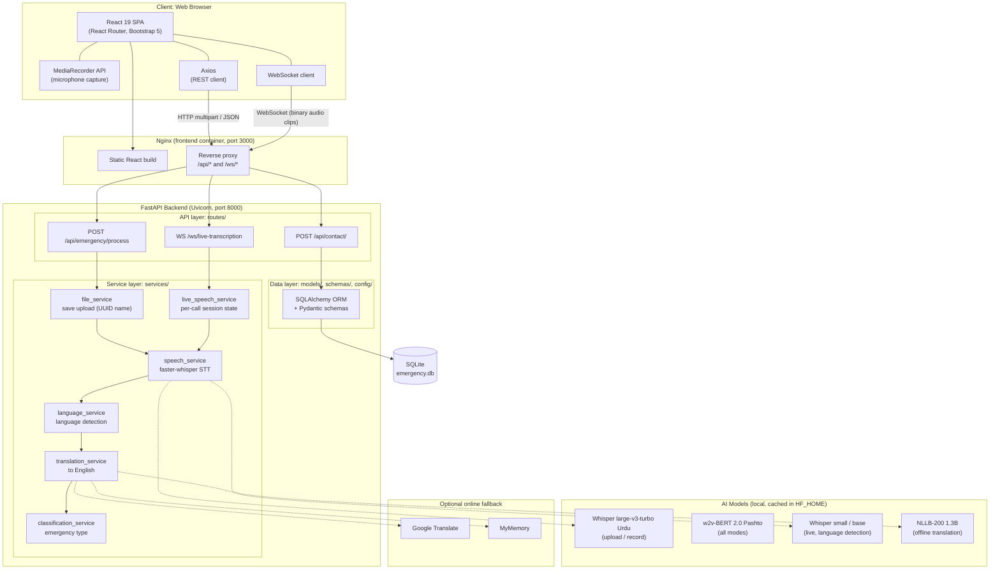
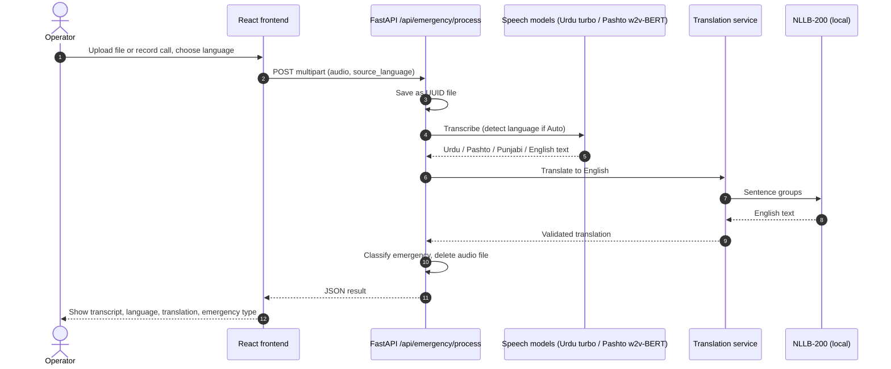
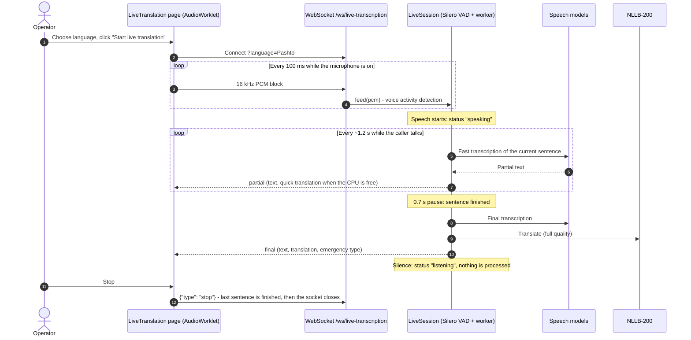
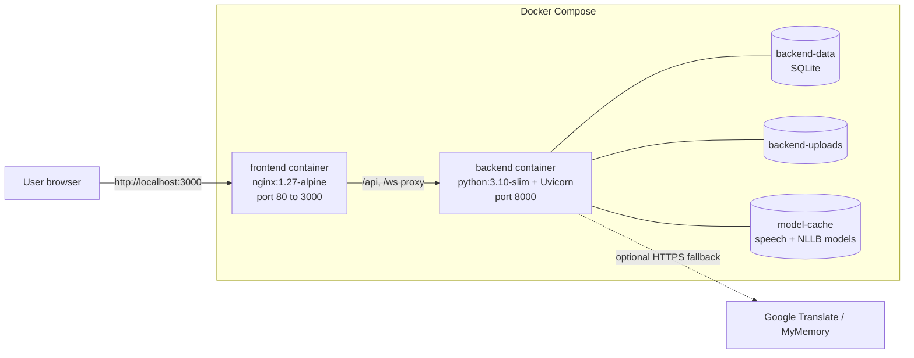
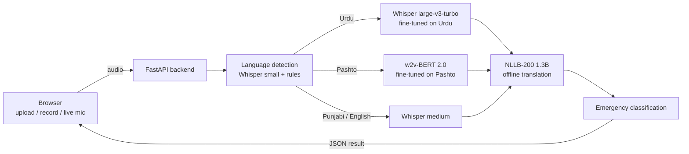

# Emergency Call Translation

An AI-based emergency communication platform for multilingual, real-time call translation. It helps emergency operators understand callers who speak **Urdu, Pashto, Punjabi or English**: the caller's speech is transcribed, translated to English and classified by emergency type (**Fire, Medical, Accident, Police**) so the operator can respond quickly.

Final Year Project by **Waqas Hussain**.

---

## Table of contents

- [Features](#features)
- [System architecture](#system-architecture)
  - [Architecture diagram](#architecture-diagram)
  - [Components](#components)
  - [Request flow: upload and record](#request-flow-upload-and-record)
  - [Request flow: live translation](#request-flow-live-translation)
  - [Deployment architecture](#deployment-architecture)
- [How it works (processing pipeline)](#how-it-works-processing-pipeline)
- [Tech stack](#tech-stack)
- [Project structure](#project-structure)
- [Getting started](#getting-started)
  - [Option A: Run with Docker (recommended)](#option-a-run-with-docker-recommended)
  - [Option B: Run locally without Docker](#option-b-run-locally-without-docker)
- [Using the application](#using-the-application)
- [Configuration](#configuration)
- [API reference](#api-reference)
- [Troubleshooting](#troubleshooting)
- [Limitations and future work](#limitations-and-future-work)
- [Privacy note](#privacy-note)

---

## Features

| Feature | Description |
|---|---|
| **Upload audio** | Upload a recorded call (MP3, WAV, M4A, OGG/Opus, WebM, AAC, FLAC, AMR) and get the transcript, English translation and emergency type. |
| **Record audio** | Record directly from the browser microphone and submit it for translation. |
| **Live translation** | Stream the microphone to the server over a WebSocket. The transcript and translation of the whole call update every few seconds. |
| **Language detection** | Detects Urdu, Pashto, Punjabi or English automatically, or uses the language the operator selects. |
| **Emergency classification** | Tags each call as Fire, Medical, Accident, Police or Unknown. |
| **Contact form** | Visitors can send a message, which is stored in the database. |

## System architecture

The system is a **three-tier web application**:

1. **Presentation tier:** a React single-page app in the browser. It captures audio (file, recording or live microphone) and shows results.
2. **Application tier:** a FastAPI backend that runs the AI pipeline: speech recognition, language detection, translation and classification.
3. **Data tier:** a SQLite database accessed through SQLAlchemy, a local cache of AI models, and external translation APIs.

### Architecture diagram



<details>
<summary><b>Plain-text version of the diagram</b> (for viewers that don't render Mermaid)</summary>

```
+---------------------------- CLIENT (Web Browser) ----------------------------+
|  React 19 SPA -- pages: Home | Upload File | Record Audio | Live | Contact    |
|     MediaRecorder (mic)        Axios (REST)            WebSocket client       |
+-------------------------------------+-------------------------+--------------+
                                      | HTTP (multipart/JSON)   | WS (binary clips)
+-------------------------------------v-------------------------v--------------+
|              NGINX  (serves React build, proxies /api and /ws)               |
+-------------------------------------+-------------------------+--------------+
                                      |                         |
+-------------------------------------v-------------------------v--------------+
|                        FASTAPI BACKEND (Uvicorn :8000)                        |
|                                                                               |
|  ROUTES    POST /api/emergency/process   WS /ws/live-transcription            |
|                 |                             |              POST /api/contact/
|  SERVICES  file_service               live_speech_service          |          |
|             (save upload)             (call session, queue)        |          |
|                 +--------------+--------------+                    |          |
|                                v                                  |          |
|                   +-------------------------+   +---------------+  |          |
|                   | speech_service          |-->| Whisper       |  |          |
|                   | (speech-to-text)        |   | medium/small  |  |          |
|                   +------------+------------+   +---------------+  |          |
|                                v                                  |          |
|                   +-------------------------+                      |          |
|                   | language_service        |                      |          |
|                   +------------+------------+                      |          |
|                                v                                  |          |
|                   +-------------------------+   +---------------+  |          |
|                   | translation_service     |-->| NLLB-200      |  |          |
|                   | (to English)            |   | (offline)     |  |          |
|                   +------------+------------+   | + online opt. |  |          |
|                                v                +---------------+  v          |
|                   +-------------------------+          +----------------+     |
|                   | classification_service  |          | SQLAlchemy ORM |     |
|                   +-------------------------+          +-------+--------+     |
|                                                                v              |
|                                                        +----------------+     |
|                                                        | SQLite DB      |     |
|                                                        +----------------+     |
+-------------------------------------------------------------------------------+
```

</details>

### Components

| Layer | Component | File | Responsibility |
|---|---|---|---|
| Frontend | Pages | [`frontend/src/pages/`](frontend/src/pages) | `Home`, `UploadAudio`, `RecordAudio`, `LiveTranslation` and `ContactUs` screens. |
| Frontend | Components | [`frontend/src/components/`](frontend/src/components) | Navbar, footer, hero banner and the `ResultCard` that shows a translation result. |
| Frontend | API client | [`frontend/src/services/api.js`](frontend/src/services/api.js) | Axios instance. Chooses the backend URL for development or production. |
| Proxy | Nginx | [`frontend/nginx.conf`](frontend/nginx.conf) | Serves the React build, forwards `/api/*` and upgrades `/ws/*` to WebSocket for the backend. |
| Backend | App entry | [`backend/app/main.py`](backend/app/main.py) | Creates the FastAPI app, CORS, routers and database tables. |
| Backend | Emergency route | [`routes/emergency_routes.py`](backend/app/routes/emergency_routes.py) | Receives an audio file and runs the pipeline in a worker thread. |
| Backend | WebSocket route | [`routes/websocket_routes.py`](backend/app/routes/websocket_routes.py) | Receives live clips, decodes them, queues and merges them, and sends results back. |
| Backend | Contact route | [`routes/contact_routes.py`](backend/app/routes/contact_routes.py) | Validates and stores contact-form messages. |
| Service | Speech-to-text | [`services/speech_service.py`](backend/app/services/speech_service.py) | Loads Whisper, restricts detection to supported languages, adds the language hint, removes loops. |
| Service | Live session | [`services/live_speech_service.py`](backend/app/services/live_speech_service.py) | Keeps the transcript and language of one live call. Re-translates the full call. |
| Service | Language detection | [`services/language_service.py`](backend/app/services/language_service.py) | Maps Whisper codes and script features to Urdu, Pashto, Punjabi or English. |
| Service | Translation | [`services/translation_service.py`](backend/app/services/translation_service.py) | Splits text into sentences, tries providers in order, validates and caches results. |
| Service | Classification | [`services/classification_service.py`](backend/app/services/classification_service.py) | Keyword-based Fire, Medical, Accident or Police tagging (English, Urdu and Pashto keywords). |
| Service | File storage | [`services/file_service.py`](backend/app/services/file_service.py) | Saves uploads under random UUID names; they are deleted after processing. |
| Data | Models and schemas | [`models/`](backend/app/models), [`schemas/`](backend/app/schemas) | SQLAlchemy tables and Pydantic request/response models. |
| Data | Database config | [`config/database.py`](backend/app/config/database.py) | Engine and session factory (`DATABASE_URL`, SQLite by default). |

### Request flow: upload and record



### Request flow: live translation



### Deployment architecture



- The **frontend** image is built in two stages: Node 22 builds the React app, then Nginx serves it.
- The **backend** container has a health check, and the frontend only starts once the backend is healthy.
- Three **named volumes** keep the database, uploads and downloaded models across restarts.

## How it works (processing pipeline)



1. **Language detection** ([`speech_service.py`](backend/app/services/speech_service.py))
   Whisper's language scores are summed over related languages: spoken Urdu is usually labelled *Hindi*, and Pashto is often labelled Persian, Arabic or even Marathi. The rule is: English if its score is at least 0.5, Urdu if the Urdu group is at least 0.7, Punjabi if it is at least 0.5, otherwise Pashto. On 30 FLEURS test recordings this identified **15/15 Urdu and 15/15 Pashto** clips, compared with 2/15 and 10/15 for Whisper's own guess. Choosing the language in the interface skips detection.

2. **Speech-to-text**: the best CPU-friendly model for each language.

   | Language | Model | Word error rate (15 FLEURS clips) |
   |---|---|---|
   | Urdu | [`kingabzpro/whisper-large-v3-urdu-ct2`](https://huggingface.co/kingabzpro/whisper-large-v3-urdu-ct2), Whisper large-v3-turbo fine-tuned on Urdu | **24.9%** (generic Whisper small: 34.5%) |
   | Pashto | [`ihanif/pashto-asr-v3`](https://huggingface.co/ihanif/pashto-asr-v3), w2v-BERT 2.0 fine-tuned on Pashto | **19.0%** (generic Whisper small: 92.0%) |
   | Punjabi, English | Whisper `medium` | not measured |

   Off-the-shelf Whisper cannot recognise Pashto: published zero-shot word error rates are above 100%, and it writes Urdu or Arabic script ([Benchmarking Multilingual Speech Models on Pashto](https://arxiv.org/abs/2604.04598)). The Pashto model is a CTC model, so it cannot fall into Whisper's repetition loops, and it is fast on a CPU (int8). No prompts are given to Whisper, because on unclear audio Whisper repeats the prompt text back.

3. **Translation** ([`translation_service.py`](backend/app/services/translation_service.py))
   - [Meta NLLB-200](https://huggingface.co/OpenNMT/nllb-200-distilled-1.3B-ct2-int8) (1.3B, int8, CTranslate2) runs **locally**: no rate limits, no internet needed, and call text stays on the server. It handles Urdu (`urd_Arab`), Pashto (`pbt_Arab`) and Punjabi in Shahmukhi (`pnb_Arab`) or Gurmukhi (`pan_Guru`).
   - Google Translate and MyMemory are only an optional fallback (`ONLINE_TRANSLATION_FALLBACK=1`). After Google answers *429 Too Many Requests* it is skipped for 10 minutes.
   - If translation fails, the text is marked `[Translation unavailable]` and the original is shown. The system never makes up a translation.

4. **Classification** ([`classification_service.py`](backend/app/services/classification_service.py)): keyword matching on the English translation and the original text.

5. **Live mode** ([`live_speech_service.py`](backend/app/services/live_speech_service.py), [`websocket_routes.py`](backend/app/routes/websocket_routes.py), [`pcm-recorder-worklet.js`](frontend/public/pcm-recorder-worklet.js))
   - The browser streams the microphone continuously as 16 kHz PCM in 100 ms blocks.
   - The Silero voice activity detector finds where speech starts and stops. While the caller speaks, a fast model sends **partial text** about every 1.2 s, with a quick translation when the CPU is free. After a **0.7 s pause** the sentence is transcribed again, translated with full quality and added to the call.
   - During silence nothing is processed, so the session simply waits. There are no fixed-length clips and no timeouts.
   - One worker per call: finished sentences always take priority and out-of-date partial results are dropped, so the delay cannot build up.

## Tech stack

| Layer | Technology | Purpose |
|---|---|---|
| **Frontend** | [React 19](https://react.dev/) (Create React App) | Single-page user interface |
| | [React Router 6](https://reactrouter.com/) | Page routing |
| | [Bootstrap 5](https://getbootstrap.com/) | Responsive layout and styling |
| | [Axios](https://axios-http.com/) | HTTP requests to the REST API |
| | MediaRecorder and WebSocket browser APIs | Microphone capture and live streaming |
| **Backend** | [Python 3.10](https://www.python.org/) | Backend language |
| | [FastAPI](https://fastapi.tiangolo.com/) | REST and WebSocket API framework |
| | [Uvicorn](https://www.uvicorn.org/) | ASGI server |
| | [Pydantic](https://docs.pydantic.dev/) | Request and response validation |
| | python-multipart | Multipart file uploads |
| **Speech recognition** | [faster-whisper](https://github.com/SYSTRAN/faster-whisper) (OpenAI Whisper on [CTranslate2](https://github.com/OpenNMT/CTranslate2)) | Urdu (fine-tuned large-v3-turbo), Punjabi, English, live mode, language detection |
| | [Transformers](https://huggingface.co/docs/transformers) + [PyTorch](https://pytorch.org/) (CPU): w2v-BERT 2.0 fine-tuned on Pashto | Pashto speech recognition |
| | [PyAV](https://github.com/PyAV-Org/PyAV) (FFmpeg) | Decodes WebM, Opus, MP3, WAV, M4A and other formats |
| | Silero VAD (built into faster-whisper) | Skips silence; detects speech start/end in live mode |
| | Web Audio API AudioWorklet | Streams the microphone as 16 kHz PCM |
| **Translation** | [Meta NLLB-200](https://ai.meta.com/research/no-language-left-behind/) 1.3B (int8, CTranslate2) | Offline translation to English |
| | Google Translate / [MyMemory](https://mymemory.translated.net/) | Optional online fallback |
| **NLP** | [langdetect](https://pypi.org/project/langdetect/) | Language detection from text |
| | Rule-based keyword classifier (English, Urdu and Pashto) | Emergency type |
| **Database** | [SQLAlchemy](https://www.sqlalchemy.org/) + SQLite | ORM and storage (MySQL is possible via `DATABASE_URL` and PyMySQL) |
| **DevOps** | [Docker](https://www.docker.com/) and Docker Compose | Containerised deployment |
| | [Nginx](https://nginx.org/) | Static hosting and reverse proxy |

### Supported languages

| Language | Whisper code | Script handled | NLLB source code |
|---|---|---|---|
| Urdu | `ur` (Hindi detections counted as Urdu) | Arabic (Nastaliq) | `urd_Arab` |
| Pashto | `ps` (Persian and Arabic detections counted as Pashto) | Arabic, with Pashto-only letters | `pbt_Arab` |
| Punjabi | `pa` | Shahmukhi (Arabic) or Gurmukhi | `pnb_Arab` or `pan_Guru` |
| English | `en` | Latin | not translated |

## Project structure

```
EmergencyCallTranslation/
├── docker-compose.yml          # Runs backend + frontend together
├── backend/
│   ├── Dockerfile
│   ├── requirements.txt
│   ├── run.py                  # Local dev server (uvicorn with reload)
│   └── app/
│       ├── main.py             # FastAPI app, CORS, routers, DB setup
│       ├── config/database.py  # SQLAlchemy engine/session (DATABASE_URL)
│       ├── models/             # SQLAlchemy models (contact messages, logs)
│       ├── schemas/            # Pydantic request/response schemas
│       ├── routes/
│       │   ├── emergency_routes.py   # POST /api/emergency/process
│       │   ├── websocket_routes.py   # WS   /ws/live-transcription
│       │   └── contact_routes.py     # POST /api/contact/
│       ├── services/
│       │   ├── speech_service.py         # Whisper speech-to-text
│       │   ├── language_service.py       # Language detection
│       │   ├── translation_service.py    # Translation to English
│       │   ├── classification_service.py # Emergency type
│       │   ├── live_speech_service.py    # Live call session state
│       │   └── file_service.py           # Saves uploads (UUID names)
│       ├── utils/constants.py
│       └── uploads/            # Temporary upload storage (git-ignored)
└── frontend/
    ├── Dockerfile
    ├── nginx.conf
    ├── package.json
    ├── public/
    └── src/
        ├── App.js              # Routes
        ├── services/api.js     # Axios client (REACT_APP_API_URL)
        ├── components/         # Navbar, Footer, HeroBanner, ResultCard
        └── pages/              # Home, UploadAudio, RecordAudio,
                                # LiveTranslation, ContactUs
```

## Getting started

### Prerequisites

- **Internet connection** on first run (to download the Whisper models, about 0.5 to 1.5 GB) and for the online translation providers.
- At least **16 GB RAM** is recommended: the speech and translation models use about 5 GB together. The first start downloads about 5 GB of models.
- For Docker: [Docker Desktop](https://www.docker.com/products/docker-desktop/).
- For local setup: **Python 3.10+**, **Node.js 18+** (22 recommended) and **Git**.

Clone the repository:

```bash
git clone https://github.com/waqar3626/EmergencyCallTranslation.git
cd EmergencyCallTranslation
```

### Option A: Run with Docker (recommended)

```bash
docker compose up --build
```

- Frontend: <http://localhost:3000>
- Backend API: <http://localhost:8000> (interactive docs at <http://localhost:8000/docs>)

The first build takes a while (PyTorch is large). Whisper models download on the first request and are cached in the `model-cache` Docker volume, so later starts are fast.

To stop:

```bash
docker compose down
```

### Option B: Run locally without Docker

#### 1. Backend

```bash
cd backend
python -m venv .venv
```

Activate the virtual environment:

- Windows (PowerShell): `.venv\Scripts\Activate.ps1`
- Windows (cmd): `.venv\Scripts\activate.bat`
- macOS / Linux: `source .venv/bin/activate`

Install dependencies and start the server:

```bash
pip install -r requirements.txt
python run.py
```

The API runs at <http://127.0.0.1:8000>. The first transcription downloads the Whisper model, which can take a few minutes.

> **Tip:** On a slower PC, use smaller models while developing:
> PowerShell: `$env:WHISPER_MODEL="small"; $env:LIVE_WHISPER_MODEL="base"; python run.py`
> macOS/Linux: `WHISPER_MODEL=small LIVE_WHISPER_MODEL=base python run.py`

#### 2. Frontend

In a second terminal:

```bash
cd frontend
npm install
npm start
```

The app opens at <http://localhost:3000>. In development it calls the backend at `http://localhost:8000` automatically.

## Using the application

1. **Upload File**: choose an audio file, pick the source language (or *Detect automatically*) and click **Translate Audio**.
2. **Record Audio**: allow microphone access, click **Start Recording**, speak, **Stop Recording**, then **Submit Audio for Translation**.
3. **Live Translation**: pick the source language, click **Start live translation** and speak. Your words appear (grey) while you talk; after each pause the sentence and its English translation are added. The status light shows *Listening*, *Hearing speech* or *Translating*. Click **Stop** to finish the last sentence and end.
4. **Contact Us**: send a message to the project team.

> **Tip:** Choosing the caller's language instead of *Detect automatically* gives the most accurate results, especially for Pashto and Punjabi.

> Browsers only allow microphone access on `https://` pages or `localhost`.

## Configuration

Backend environment variables:

| Variable | Default | Description |
|---|---|---|
| `URDU_ASR_MODEL` | `kingabzpro/whisper-large-v3-urdu-ct2` | Urdu speech model for uploads and recordings. |
| `PASHTO_ASR_MODEL` | `ihanif/pashto-asr-v3` | Pashto speech model (all modes). A Hugging Face ID or a local folder. |
| `WHISPER_MODEL` | `medium` | Whisper model for Punjabi and English uploads/recordings. |
| `LIVE_WHISPER_MODEL` | `small` | Whisper model for finished sentences in live mode (Urdu, Punjabi, English). |
| `LIVE_PARTIAL_MODEL` | `base` | Fastest Whisper model, for the interim text shown while the caller talks. |
| `LID_WHISPER_MODEL` | same as `LIVE_WHISPER_MODEL` | Whisper model used to detect the spoken language. |
| `NLLB_MODEL` | `OpenNMT/nllb-200-distilled-1.3B-ct2-int8` | Offline translation model. |
| `ONLINE_TRANSLATION_FALLBACK` | `1` | Use Google Translate / MyMemory if NLLB is unavailable (`0` = never send text online). |
| `PRELOAD_MODELS` | `1` | Load all models in the background at start-up. |
| `DATABASE_URL` | `sqlite:///./emergency.db` | SQLAlchemy database URL. |
| `HF_HOME` | Hugging Face default | Where downloaded models are cached. |

Frontend build-time variables:

| Variable | Default | Description |
|---|---|---|
| `REACT_APP_API_URL` | `http://localhost:8000` in dev, same origin in production | Backend base URL. |
| `REACT_APP_WS_URL` | `ws://<host>:8000` in dev, same origin in production | WebSocket base URL. |

## API reference

### `POST /api/emergency/process`

Transcribe, translate and classify an audio file.

Form data:
- `audio` (file, required)
- `source_language` (optional): `Auto` (default), `Urdu`, `Pashto`, `Punjabi` or `English`

Response:

```json
{
  "original_text": "ہیلو، ایمرجنسی ہے۔ ہمارے گھر میں آگ لگی ہے، جلدی آ جائیں۔",
  "detected_language": "Urdu",
  "translated_text": "Hello, it's an emergency. Our house is on fire, come quickly.",
  "emergency_type": "Fire"
}
```

Example:

```bash
curl -F "audio=@call.wav" -F "source_language=Urdu" http://localhost:8000/api/emergency/process
```

### `WS /ws/live-transcription?language=<Auto|Urdu|Pashto|Punjabi|English>`

- Send **binary** messages, each one a complete audio clip (for example a WebM/Opus file from `MediaRecorder`).
- Send `{"type": "ping"}` as text to keep the connection alive. The server replies `{"type": "pong"}`.
- After each clip the server sends the result for **the whole call so far**:

```json
{
  "original_text": "…full transcript…",
  "detected_language": "Urdu",
  "translated_text": "…full English translation…",
  "emergency_type": "Fire",
  "segment_text": "…text from the latest clip…"
}
```

### `POST /api/contact/`

JSON body: `phone`, `email`, `title`, `message`, `address`. Stores the message and returns it with an `id` and `date_sent`.

## Troubleshooting

| Problem | Solution |
|---|---|
| First request is very slow | The Whisper model is downloading and loading. Later requests are much faster. |
| `Unable to contact the backend server` | Make sure the backend is running on port 8000 (`python run.py` or `docker compose ps`). |
| Microphone does not work | Allow microphone permission in the browser and use `localhost` or `https://`. |
| Live translation is slow | Plug the laptop in: on battery, Windows throttles the CPU (we measured 31% speed), which makes every model about 3x slower. Or use smaller models, for example `LIVE_WHISPER_MODEL=base`. |
| Pashto is shown as Urdu | Select **Pashto** as the source language instead of *Detect automatically*. |
| `[Translation unavailable]` in results | The online translation services could not be reached. Check the internet connection. |
| Out-of-memory errors | Use a smaller model: `WHISPER_MODEL=small`. |

## Limitations and future work

- Speech recognition accuracy depends on audio quality and the Whisper model size. `medium` or `large-v3` give the best Urdu and Pashto results.
- Emergency classification is keyword-based. A trained text classifier would be more robust.
- Online translation needs internet access. A fully offline multilingual model (for example Meta's NLLB-200, which supports Pashto) could replace it.
- There is no authentication or operator dashboard yet, and calls are not stored for later review.

## Privacy note

Uploaded audio is deleted from the server as soon as it has been processed. Speech recognition and translation run locally, so call audio and text stay on the server. Text is only sent to Google Translate or MyMemory if the local translation model is unavailable; set `ONLINE_TRANSLATION_FALLBACK=0` to prevent that entirely.

---

© Waqas Hussain. All rights reserved.
